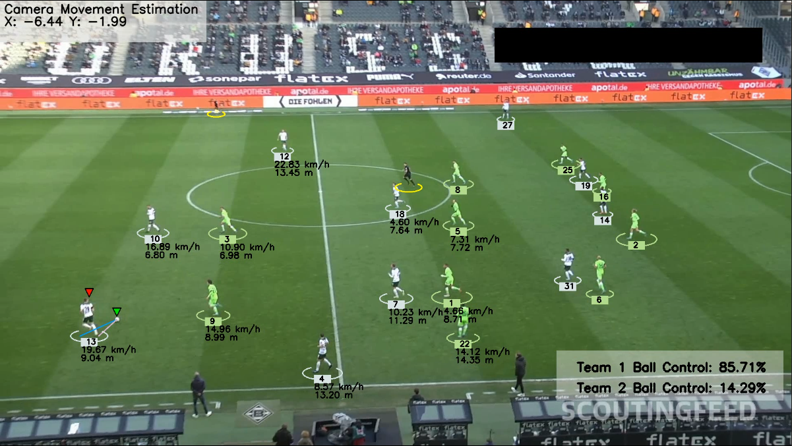

# Introduction


This project is designed to track football players and analyze their movements in order to create diverse statistics such as team ball possession, distance covered, speed etc. In order to do so we're making use of the state of the art convolotional neural network YOLO to create the model, Roboflow for the dataset, SuperVision OpenCV for image processing, numpy, pandas and others.

## Dependencies
- OpenCV
- NumPy
- PyTorch
- Ultralytics YOLOv5/YOLOv8
- Supervision
- roboflow

```sh
git clone https://github.com/gryg/football-analysis
cd football-analysis
pip install -r requirements.txt
# create an .env and input enter your own roboflow_API_KEY=your_roboflow_api_key
```